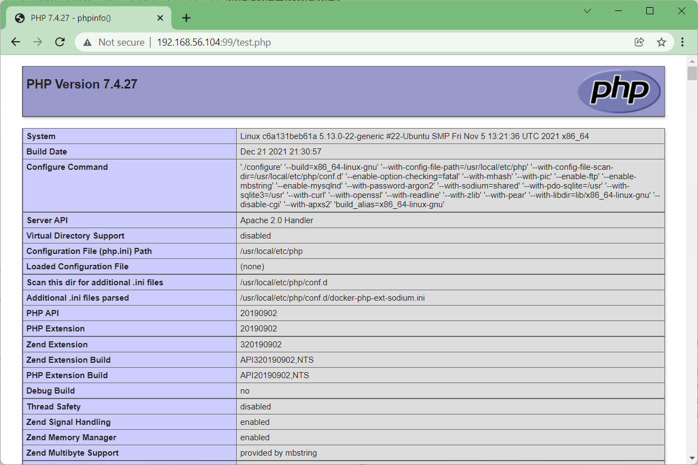

# PHP - Instalación Docker

## Descarregueu la imatge de Docker php amb Apache.

```bash
joan@ubuntu-docker:~$ docker pull php:7.4-apache
```

Llisteu les imatges de Docker que teniu instal·lades al sistema.

```bash
joan@ubuntu-docker:~$ docker images
REPOSITORY              TAG                 IMAGE ID            CREATED             SIZE
php                     7.4-apache          7a935726473b        13 days ago         414MB

```

Creeu un volum acoblable per a les dades persistents.

```bash
joan@ubuntu-docker:~$ sudo docker volume create apache-data
apache-data
```

Comproveu el directori de dades persistent.

```bash
joan@ubuntu-docker:~$ sudo docker volume inspect apache-data
[
    {
        "CreatedAt": "2020-07-06T14:06:51Z",
        "Driver": "local",
        "Labels": {},
        "Mountpoint": "/var/lib/docker/volumes/apache-data/_data",
        "Name": "apache-data",
        "Options": {},
        "Scope": "local"
    }
]
```

Opcionalment, creeu un enllaç simbòlic a una ubicació d'accés més fàcil.

```bash
joan@ubuntu-docker:~$ sudo ln -s /var/lib/docker/volumes/apache-data/_data /apache
```

Inicieu un contenidor Apache amb suport PHP i emmagatzematge de dades persistent.

```bash
joan@ubuntu-docker:~$ sudo docker run -d --name apache-php -p 90:80 -v apache-data:/var/www/html  php:7.4-apache
c6a131beb61a5c624e89d16f9af663f2eb3f04dcf9023442bce6fd1307e288d9
```

En el nostre exemple, la imatge de Docker es va fer servir per iniciar un nou contenidor.

El nou contenidor utilitza el port local 90.

L'identificador del contenidor és ```c6a131beb61a5c624e89d16f9af663f2eb3f04dcf9023442bce6fd1307e288d9```.

```bash
joan@ubuntu-docker:~$ sudo docker ps
CONTAINER ID   IMAGE            COMMAND                  CREATED          STATUS         PORTS                               NAMES
c6a131beb61a   php:7.4-apache   "docker-php-entrypoi…"   11 minutes ago   Up 9 minutes   0.0.0.0:99->80/tcp, :::99->80/tcp   apache-php
```

# Tutorial Apache - Prova de la instal·lació de Docker

Creeu una pàgina de prova PHP dins del volum de Docker.

```bash
joan@ubuntu-docker:~$ sudo cd /var/lib/docker/volumes/apache-data/_data
joan@ubuntu-docker:~$ sudo vi test.php
```

Aquí hi ha el contingut del fitxer.

```html
<?php
phpinfo();
?>
```


Obriu el vostre navegador i introduïu l'adreça IP del vostre servidor web.

En el nostre exemple, es va introduir la següent URL al navegador:

• http://192.168.100.10:90/test.php

El servidor Apache mostrarà la pàgina de prova PHP.



Felicitacions! La instal·lació de PHP Docker s'ha provat correctament.

## Tutorial PHP - Administració de contenidors Docker
Comproveu l'estat de tots els contenidors de Docker mitjançant l'ordre següent:

```bash
joan@ubuntu-docker:/var/lib/docker/volumes/apache-data/_data$ sudo docker ps -aCONTAINER ID   IMAGE            COMMAND                  CREATED          STATUS          PORTS                               NAMES
c6a131beb61a   php:7.4-apache   "docker-php-entrypoi…"   23 minutes ago   Up 21 minutes   0.0.0.0:99->80/tcp, :::99->80/tcp   apache-php
```

Comproveu l'estat del contenidor Apache mitjançant l'ID o el vostre nom.

```bash
joan@ubuntu-docker:~$ sudo docker ps -a -f id=c6a131beb61a5c624e89d16f9af663f2eb3f04dcf9023442bce6fd1307e288d9
CONTAINER ID   IMAGE            COMMAND                  CREATED          STATUS          PORTS                               NAMES
c6a131beb61a   php:7.4-apache   "docker-php-entrypoi…"   23 minutes ago   Up 21 minutes   0.0.0.0:99->80/tcp, :::99->80/tcp   apache-php

joan@ubuntu-docker:~$ sudo docker ps -a -f name=apache-php
CONTAINER ID   IMAGE            COMMAND                  CREATED          STATUS          PORTS                               NAMES
c6a131beb61a   php:7.4-apache   "docker-php-entrypoi…"   23 minutes ago   Up 21 minutes   0.0.0.0:99->80/tcp, :::99->80/tcp   apache-php

joan@ubuntu-docker:~$ 
```

Per aturar el servei de contenidor Apache, utilitzeu la següent ordre:

```bash
joan@ubuntu-docker:~$ sudo docker container stop c6a131beb61a5c624e89d16f9af663f2eb3f04dcf9023442bce6fd1307e288d9
c6a131beb61a5c624e89d16f9af663f2eb3f04dcf9023442bce6fd1307e288d9
```

 o bé

```bash
joan@ubuntu-docker:~$ sudo docker container stop apache-php
apache-php
joan@ubuntu-docker:~$ 
```

Per iniciar el servei de contenidor Apache, utilitzeu la següent ordre:

```bash
joan@ubuntu-docker:~$ sudo docker container start c6a131beb61a5c624e89d16f9af663f2eb3f04dcf9023442bce6fd1307e288d9
c6a131beb61a5c624e89d16f9af663f2eb3f04dcf9023442bce6fd1307e288d9
```

 o bé

```bash
joan@ubuntu-docker:~$ sudo docker container stop apache-php
apache-php
joan@ubuntu-docker:~$ 
```

Per reiniciar el servei de contenidor Apache, utilitzeu la següent ordre:

```bash
joan@ubuntu-docker:~$ sudo docker container restart c6a131beb61a5c624e89d16f9af663f2eb3f04dcf9023442bce6fd1307e288d9
```

 o bé

```bash
joan@ubuntu-docker:~$ sudo docker container restart apache-php
```

En cas d'error, utilitzeu l'ordre següent per verificar els registres del contenidor Apache.

> ```bash
> joan@ubuntu-docker:~$ sudo docker logs c6a131beb61a5c624e89d16f9af663f2eb3f04dcf9023442bce6fd1307e288d9
> ke Gecko) Chrome/96.0.4664.110 Safari/537.36"
> 192.168.56.1 - - [06/Jul/2020:14:19:00 +0000] "GET /favicon.ico HTTP/1.1" 404 492 "http://192.168.56.104:99/" "Mozilla/5.0 (Windows NT 10.0; Win64; x64) AppleWebKit/537.36 (KHTML, like Gecko) Chrome/96.0.4664.110 Safari/537.36"
> 192.168.56.1 - - [06/Jul/2020:14:19:51 +0000] "-" 408 0 "-" "-"
> [Mon Jul 06 14:20:52.560677 2020] [mpm_prefork:notice] [pid 1] AH00170: caught SIGWINCH, shutting down gracefully
> AH00558: apache2: Could not reliably determine the server's fully qualified domain name, using 172.17.0.7. Set the 'ServerName' directive globally to suppress this message
> AH00558: apache2: Could not reliably determine the server's fully qualified domain name, using 172.17.0.7. Set the 'ServerName' directive globally to suppress this message
> [Mon Jul 06 14:20:59.521341 2020] [mpm_prefork:notice] [pid 1] AH00163: Apache/2.4.51 (Debian) PHP/7.4.27 configured -- resuming normal operations
> [Mon Jul 06 14:20:59.521503 2020] [core:notice] [pid 1] AH00094: Command line: 'apache2 -D FOREGROUND'
> [Mon Jul 06 14:27:57.009327 2020] [autoindex:error] [pid 22] [client 192.168.56.1:58598] AH01276: Cannot serve directory /var/www/html/: No matching DirectoryIndex (index.php,index.html) found, and server-generated directory index forbidden by Options directive
> 192.168.56.1 - - [06/Jul/2020:14:27:57 +0000] "GET / HTTP/1.1" 403 496 "-" "Mozilla/5.0 (Windows NT 10.0; Win64; x64) AppleWebKit/537.36 (KHTML, like Gecko) Chrome/96.0.4664.110 Safari/537.36"
> 192.168.56.1 - - [06/Jul/2020:14:27:57 +0000] "GET /favicon.ico HTTP/1.1" 404 492 "http://192.168.56.104:99/" "Mozilla/5.0 (Windows NT 10.0; Win64; x64) AppleWebKit/537.36 (KHTML, like Gecko) Chrome/96.0.4664.110 Safari/537.36"
> 192.168.56.1 - - [06/Jul/2020:14:28:48 +0000] "-" 408 0 "-" "-"
> 192.168.56.1 - - [06/Jul/2020:14:32:20 +0000] "GET /test.php HTTP/1.1" 200 22363 "-" "Mozilla/5.0 (Windows NT 10.0; Win64; x64) AppleWebKit/537.36 (KHTML, like Gecko) Chrome/96.0.4664.110 Safari/537.36"
> 192.168.56.1 - - [06/Jul/2020:14:33:11 +0000] "-" 408 0 "-" "-"
> [Mon Jul 06 14:43:41.684578 2020] [mpm_prefork:notice] [pid 1] AH00170: caught SIGWINCH, shutting down gracefully
> AH00558: apache2: Could not reliably determine the server's fully qualified domain name, using 172.17.0.7. Set the 'ServerName' directive globally to suppress this message
> AH00558: apache2: Could not reliably determine the server's fully qualified domain name, using 172.17.0.7. Set the 'ServerName' directive globally to suppress this message
> [Mon Jul 06 14:44:46.235711 2020] [mpm_prefork:notice] [pid 1] AH00163: Apache/2.4.51 (Debian) PHP/7.4.27 configured -- resuming normal operations
> [Mon Jul 06 14:44:46.235895 2020] [core:notice] [pid 1] AH00094: Command line: 'apache2 -D FOREGROUND'
> ```

 o bé

> ```bash
> joan@ubuntu-docker:~$ sudo docker logs apache-php
> ke Gecko) Chrome/96.0.4664.110 Safari/537.36"
> 192.168.56.1 - - [06/Jul/2020:14:19:00 +0000] "GET /favicon.ico HTTP/1.1" 404 492 "http://192.168.56.104:99/" "Mozilla/5.0 (Windows NT 10.0; Win64; x64) AppleWebKit/537.36 (KHTML, like Gecko) Chrome/96.0.4664.110 Safari/537.36"
> 192.168.56.1 - - [06/Jul/2020:14:19:51 +0000] "-" 408 0 "-" "-"
> [Mon Jul 06 14:20:52.560677 2020] [mpm_prefork:notice] [pid 1] AH00170: caught SIGWINCH, shutting down gracefully
> AH00558: apache2: Could not reliably determine the server's fully qualified domain name, using 172.17.0.7. Set the 'ServerName' directive globally to suppress this message
> AH00558: apache2: Could not reliably determine the server's fully qualified domain name, using 172.17.0.7. Set the 'ServerName' directive globally to suppress this message
> [Mon Jul 06 14:20:59.521341 2020] [mpm_prefork:notice] [pid 1] AH00163: Apache/2.4.51 (Debian) PHP/7.4.27 configured -- resuming normal operations
> [Mon Jul 06 14:20:59.521503 2020] [core:notice] [pid 1] AH00094: Command line: 'apache2 -D FOREGROUND'
> [Mon Jul 06 14:27:57.009327 2020] [autoindex:error] [pid 22] [client 192.168.56.1:58598] AH01276: Cannot serve directory /var/www/html/: No matching DirectoryIndex (index.php,index.html) found, and server-generated directory index forbidden by Options directive
> 192.168.56.1 - - [06/Jul/2020:14:27:57 +0000] "GET / HTTP/1.1" 403 496 "-" "Mozilla/5.0 (Windows NT 10.0; Win64; x64) AppleWebKit/537.36 (KHTML, like Gecko) Chrome/96.0.4664.110 Safari/537.36"
> 192.168.56.1 - - [06/Jul/2020:14:27:57 +0000] "GET /favicon.ico HTTP/1.1" 404 492 "http://192.168.56.104:99/" "Mozilla/5.0 (Windows NT 10.0; Win64; x64) AppleWebKit/537.36 (KHTML, like Gecko) Chrome/96.0.4664.110 Safari/537.36"
> 192.168.56.1 - - [06/Jul/2020:14:28:48 +0000] "-" 408 0 "-" "-"
> 192.168.56.1 - - [06/Jul/2020:14:32:20 +0000] "GET /test.php HTTP/1.1" 200 22363 "-" "Mozilla/5.0 (Windows NT 10.0; Win64; x64) AppleWebKit/537.36 (KHTML, like Gecko) Chrome/96.0.4664.110 Safari/537.36"
> 192.168.56.1 - - [06/Jul/2020:14:33:11 +0000] "-" 408 0 "-" "-"
> [Mon Jul 06 14:43:41.684578 2020] [mpm_prefork:notice] [pid 1] AH00170: caught SIGWINCH, shutting down gracefully
> AH00558: apache2: Could not reliably determine the server's fully qualified domain name, using 172.17.0.7. Set the 'ServerName' directive globally to suppress this message
> AH00558: apache2: Could not reliably determine the server's fully qualified domain name, using 172.17.0.7. Set the 'ServerName' directive globally to suppress this message
> [Mon Jul 06 14:44:46.235711 2020] [mpm_prefork:notice] [pid 1] AH00163: Apache/2.4.51 (Debian) PHP/7.4.27 configured -- resuming normal operations
> [Mon Jul 06 14:44:46.235895 2020] [core:notice] [pid 1] AH00094: Command line: 'apache2 -D FOREGROUND'
> ```

En els nostres exemples, mostrem com administrar el contenidor PHP usant el vostre ID o el nom prèviament definit.

s
